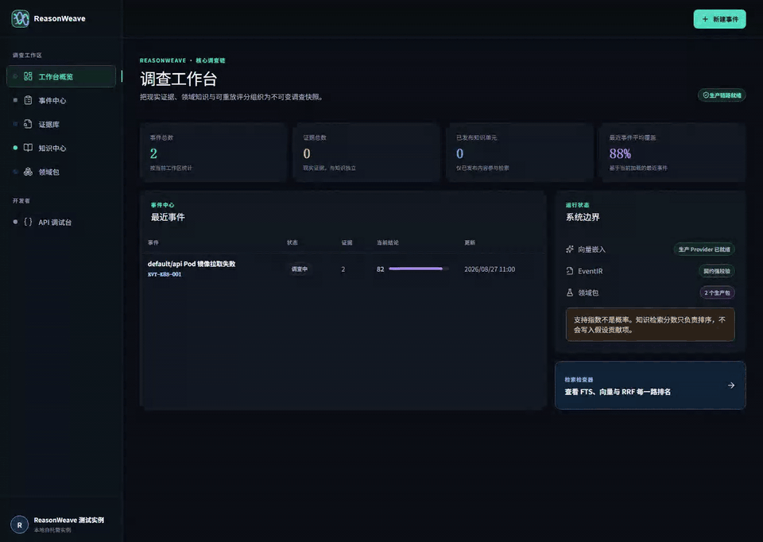
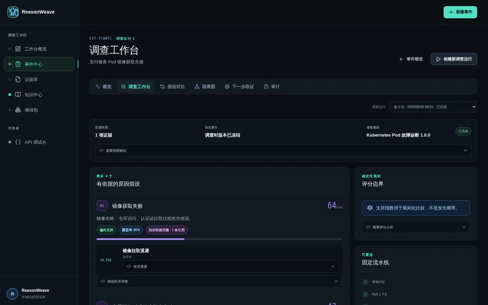
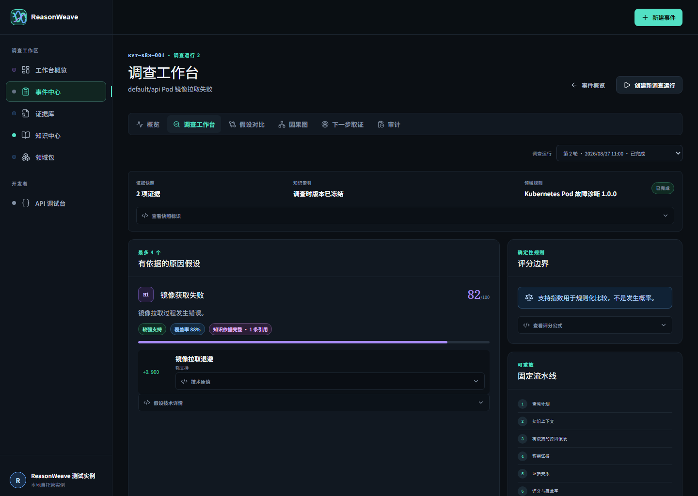
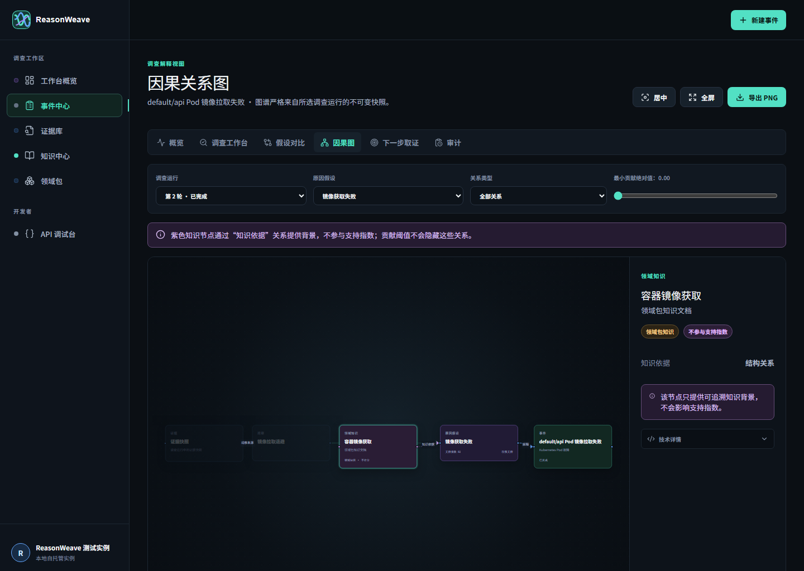
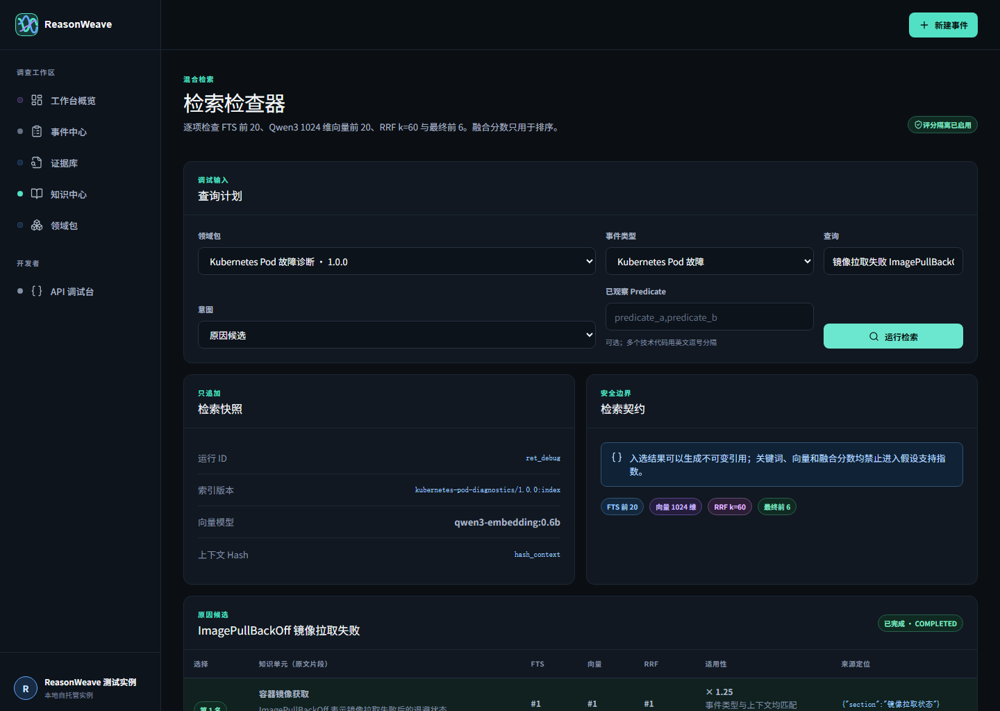
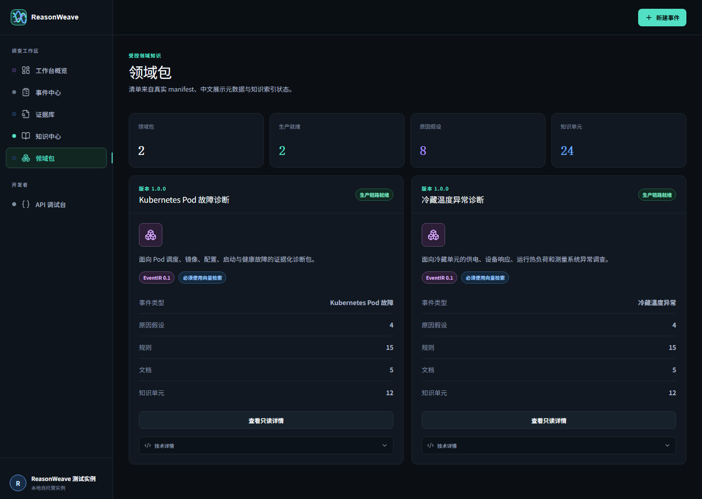

<div align="center">
  
  <h1>ReasonWeave</h1>
  <p><strong>你需要的不只是一个答案，而是一条能证明结论如何由已确认事实、领域规则与可追溯知识形成的证据链。</strong></p>
  <p>自托管、API-first、领域包驱动的证据推理引擎。</p>
  <p>面向 API 集成者、故障调查系统，以及设备与运营异常诊断。</p>
  <p>
    <a href="#五分钟启动"><strong>五分钟启动</strong></a>
    · <a href="docs/api-quickstart.md">纯 API</a>
    · <a href="README.en.md">English</a>
    · <a href="docs/media/reasonweave-demo.mp4">演示视频</a>
  </p>
  <p><code>0.4.1 preview</code> · <code>Apache-2.0</code> · <code>本地优先</code> · <code>无内置遥测</code></p>
</div>

> [!CAUTION]
> 当前预览版是无认证的单实例服务，只应绑定回环地址或放在你自行加固的可信反向代理之后。它不替代人工判断，也不提供自动维修、食品处置或监管结论。

<p align="center">
  
</p>

<p align="center"><em>24 秒真实测试栈流程，使用合成数据。<a href="docs/media/reasonweave-demo.mp4">查看清晰 MP4</a></em></p>

## 一个调查结果长什么样

<p align="center">
  
</p>

下面不是营销示例，而是自动化 Golden Investigation 在真实 PostgreSQL、pgvector 与 Qwen3 Embedding 栈上的归一化输出：

```json
{
  "confirmed_observation": "image_pull_backoff = true",
  "top_hypothesis": "镜像获取失败",
  "support_index": 64,
  "coverage": 0.3571,
  "scoring_evidence": [
    { "predicate": "image_pull_backoff", "contribution": 0.95 }
  ],
  "citations": [
    { "section": "容器镜像获取失败", "score_affecting": false },
    { "section": "可观察状态", "score_affecting": false }
  ],
  "next_evidence": "查看 Pod 调度条件和相关事件"
}
```

- **现实证据计分：** 只有人工确认的 Observation 能通过确定性规则产生贡献。
- **知识只做依据：** Citation 来自冻结的检索快照，用于约束和解释假设，永远不增加支持指数。
- **结果可继续调查：** Coverage、证据缺口和下一步取证明确告诉调用方还缺什么。
- **支持指数不是概率：** `64` 表示当前证据与规则下的相对支持程度，不表示原因有 64% 概率成立。

完整机器可读结果见 [Kubernetes 示例](docs/examples/kubernetes-investigation-summary.json) 与 [冷藏温度异常示例](docs/examples/cold-holding-investigation-summary.json)。

## 它解决什么

许多诊断系统最后只留下一个答案。ReasonWeave 保存形成答案的整个过程：

```text
Domain Pack → EventIR → Evidence / Observation → Retrieval Snapshot
→ Grounded Hypothesis → Deterministic Score / Coverage → Next Evidence / Graph / Audit
```

- **可复核：** 每条结论都能回到现实证据、规则、Citation 和 Source Locator。
- **不可悄改：** 调查运行、证据快照和检索快照只追加；新证据创建新 Run，旧结果保持不变。
- **领域可替换：** 事件 Schema、Predicate、规则、知识、来源可靠度和展示元数据都来自纯数据 `.rwpack`。
- **API 是主入口：** 控制台和外部系统使用同一组公共 API，不需要把业务接进某个专用界面。

ReasonWeave 不是聊天机器人、统计预测模型或自动裁决器。调查核心不调用生成式 Chat LLM；生产领域包使用真实 Embedding 做知识召回，并用可重放的规则计算结果。

## 五分钟启动

### 前置条件

- x86-64 Linux、macOS 或 Windows
- Docker Engine / Docker Desktop
- Docker Compose v2
- 建议至少 4 GiB 可用内存；真实向量检索建议 6 GiB 以上

运行服务不需要 Node、pnpm、Java 或 Maven，也不需要手工创建 Docker Volume。

### Linux / macOS

```bash
git clone https://github.com/Chen-AnJu/ReasonWeave.git
cd ReasonWeave
./scripts/init-local.sh
docker compose up -d
curl --fail-with-body http://127.0.0.1:8080/api/v1/runtime
```

### Windows PowerShell

```powershell
git clone https://github.com/Chen-AnJu/ReasonWeave.git
Set-Location ReasonWeave
powershell -ExecutionPolicy Bypass -File .\scripts\init-local.ps1
docker compose up -d
Invoke-RestMethod http://127.0.0.1:8080/api/v1/runtime
```

打开 <http://127.0.0.1:8080>。OpenAPI 位于 <http://127.0.0.1:8080/api/v1/docs>。

默认 Compose 拉取固定版本的预构建镜像，只有前端绑定 `127.0.0.1:8080`；后端、PostgreSQL 和 Ollama 不暴露宿主端口。首次启动会下载约 639 MB 的 `qwen3-embedding:0.6b` 到固定命名卷 `reasonweave-ollama-model-cache`：

```bash
docker compose logs -f ollama-model
```

以后执行 `docker compose down`、重启或升级都会复用该模型卷。详细资源、端口、索引和卷问题见[故障排查](docs/troubleshooting.md)。

> 想从源码构建？使用 `docker compose -f compose.yml -f compose.build.yml up -d --build`。这条开发者路径才需要构建工具与更长时间。

## 一条命令体验完整 API 闭环

安装了 Node.js 22 的用户可以运行无第三方依赖的合成场景客户端：

```bash
node examples/quickstart/run.mjs --scenario kubernetes
node examples/quickstart/run.mjs --scenario cold-holding
```

它会自动完成领域发现、事件创建、Bundle 导入、Observation 确认、调查、Citation、下一步取证、图谱和审计，并输出归一化摘要。这个运行器只是可选客户端，服务本身不依赖 Node。

## 纯 API 集成

客户端遵循稳定的发现式流程，不应硬编码 Kubernetes 或冷藏字段：

```text
GET  /api/v1/runtime
GET  /api/v1/domain-packs
GET  /api/v1/domain-packs/{key}/versions/{version}/event-types/{eventType}
POST /api/v1/events                                      Idempotency-Key
POST /api/v1/events/{eventId}/evidence/bundles
PATCH /api/v1/observations/{observationId}               If-Match
POST /api/v1/events/{eventId}/investigations             Idempotency-Key
GET  /api/v1/investigations/{investigationId}
GET  /api/v1/investigations/{investigationId}/next-evidence
GET  /api/v1/events/{eventId}/graph
GET  /api/v1/events/{eventId}/audit
```

所有响应使用 `{data, meta}` 或 `{error, meta}`，`meta.request_id` 可用于日志定位。Bash、PowerShell、真实成功/失败响应和完整请求体见[中文 API 快速开始](docs/api-quickstart.md)；固定合同见 [`contracts/openapi/reasonweave-v1.json`](contracts/openapi/reasonweave-v1.json)。

## 两个不同产业的内置领域包

| 领域包 | 调查范围 | 专业依据与边界 |
| --- | --- | --- |
| `kubernetes-pod-diagnostics/1.0.0` | Kubernetes 1.35–1.37 Pod 调度、镜像、配置/挂载、启动与健康检查故障 | 规则参考 Apache-2.0 的 K8sGPT Pod Analyzer，知识来自 Kubernetes 官方文档的 CC BY 4.0 派生摘要；不自动修复 |
| `cold-holding-excursion-diagnostics/1.0.0` | 零售、餐饮和冷库的供电/控制、制冷响应、运行热负荷与测量系统异常 | 知识来自 FDA/DOE 公共资料；现场阈值由用户提供，不判断食品安全、报废、合规或 HACCP 状态 |

两个领域完全复用同一套 Event、Bundle、检索、调查、图谱和审计 API，证明核心不是 Kubernetes 专用工具。组件级来源、许可证、上游版本和内容 Hash 记录在每个包的 `LICENSES.yaml` 与 `NOTICE.md`。

## 控制台

<table>
  <tr>
    <td width="50%"></td>
    <td width="50%"></td>
  </tr>
  <tr>
    <td><strong>调查工作台</strong><br>冻结证据、知识索引和规则，显示可重算贡献、支持指数与覆盖率。</td>
    <td><strong>因果关系图</strong><br>沿 Evidence、Observation、Hypothesis、Knowledge 和 Event 回看完整路径。</td>
  </tr>
  <tr>
    <td></td>
    <td></td>
  </tr>
  <tr>
    <td><strong>检索检查器</strong><br>逐项查看 FTS、向量、RRF、适用性和最终入选结果。</td>
    <td><strong>领域包</strong><br>从真实 manifest 展示事件类型、规则、知识、许可和索引就绪状态。</td>
  </tr>
</table>

## 信任与隐私边界

- 默认无遥测；事件、证据、索引和调查结果保存在本地数据库与 Blob 卷。
- `.rwpack` 只能包含 Schema、规则、知识、展示和许可证，不能执行第三方代码。
- Bundle 必须匹配事件领域、类型和主对象；任一项失败则整包回滚。
- 每个 Run 保存领域包指纹、证据快照、知识索引、检索结果和 Citation。
- Kubernetes 采集器不读取 Secret 值、环境变量值、ServiceAccount Token 或完整日志。
- 冷藏采集器不访问网络，Bundle 不包含完整原始遥测。
- 当前没有登录、API Key、RBAC、多租户、限流或公网安全边界。

更完整的组件和信任边界见[公开架构](docs/architecture.md)。漏洞请按 [SECURITY.md](SECURITY.md) 私下报告。

## 开发与验证

源码开发需要 Node.js 22、pnpm 11 和 Java 21：

```bash
pnpm install --frozen-lockfile
pnpm verify:open-source
pnpm cli:test
pnpm frontend:check
pnpm frontend:test
pnpm frontend:build
pnpm api:types:check
pnpm backend:test
```

完整要求与最小验证矩阵见 [CONTRIBUTING.md](CONTRIBUTING.md)。项目不依赖 GitHub Actions；维护者可在任意受控环境执行同样的公开命令。

## 仓库结构

```text
backend/                 Spring Boot 推理 API
frontend/                React 通用控制台与同源网关
contracts/               EventIR、Domain Pack、Bundle 与 OpenAPI
domain-packs/            内置正式领域包
fixtures/domain-packs/   领域中立测试包
tools/                   rwpack 与 rw-evidence CLI
examples/                可选的纯 API 示例客户端
docs/                    API、架构、示例、截图与演示
infra/                   PostgreSQL / Ollama 镜像和隔离测试配置
compose.yml              预构建镜像快速启动
compose.build.yml        源码构建覆盖层
```

## 文档导航

- [API 快速开始（中文）](docs/api-quickstart.md) · [API Quick Start (English)](docs/api-quickstart.en.md)
- [公开架构](docs/architecture.md)
- [领域包 CLI](tools/domain-pack-cli/README.md)
- [证据采集器](tools/evidence-cli/README.md)
- [故障排查](docs/troubleshooting.md) · [支持范围](SUPPORT.md)
- [贡献说明](CONTRIBUTING.md) · [安全策略](SECURITY.md) · [变更记录](CHANGELOG.md)
- [视觉资产来源与 Hash](ASSET_PROVENANCE.md)

## 当前状态

`0.4.1` 已具备双领域、真实 Embedding、纯 API 和可视化控制台的完整调查闭环，当前定位为开源预览。登录、RBAC、多租户、异步调查、Webhook、自动修复、远程领域包 Registry、热加载、计费和 Marketplace 明确后置。

## 许可证

源代码按 [Apache License 2.0](LICENSE) 发布，第三方说明见 [NOTICE](NOTICE)。视觉资产依据见 [ASSET_PROVENANCE.md](ASSET_PROVENANCE.md)；领域包组件许可证以各自 `LICENSES.yaml` 和 `NOTICE.md` 为准。
