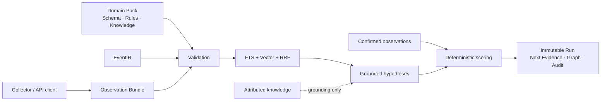

<div align="center">
  
  <h1>ReasonWeave</h1>
  <p><strong>把现实证据、领域知识与确定性规则，编织成可复核的调查结论。</strong></p>
  <p>一个自托管、API-first、领域包驱动的证据推理引擎。</p>
  <p>
    <a href="#快速启动"><strong>快速启动</strong></a>
    · <a href="docs/api-quickstart.md">纯 API 快速开始</a>
    · <a href="docs/architecture.md">公开架构</a>
    · <a href="docs/media/reasonweave-demo.mp4">演示视频</a>
  </p>
  <p><code>0.4.1 preview</code> · <code>Apache-2.0</code> · <code>本地优先</code> · <code>无内置遥测</code></p>
</div>

> [!CAUTION]
> `0.4.1` 是已公开源码的预览候选，尚未创建 Git 标签或安装包发行版。当前版本是无认证的单实例服务，只应绑定回环地址或放在自行加固的可信反向代理之后。

<p align="center">
  
</p>

<p align="center"><em>约 10 秒产品流程演示。画面使用合成示例数据，不代表线上事件或真实诊断结果。<a href="docs/media/reasonweave-demo.mp4">查看 MP4</a></em></p>

## 它解决什么

- **把结论留在证据上。** 每个判断都能回到 Observation、规则、知识引用和 Source Locator，而不是只保留一段不可复核的回答。
- **让新证据产生新快照。** 调查运行、检索上下文和证据快照不可变；重新调查会创建新 Run，旧结果不会被悄悄改写。
- **把行业差异移出核心。** 事件 Schema、Predicate、规则、知识、来源可靠度和中文展示都由纯数据领域包定义。
- **先提供 API，再提供控制台。** 外部系统可以完成整个调查闭环；React 控制台只是同一组公共 API 的通用客户端。

ReasonWeave 不是聊天机器人，也不是自动裁决器。**知识只负责提出、约束和解释假设；只有已确认的现实证据能进入支持指数。支持指数不是概率。**

## 一次调查如何闭环

1. **发现领域。** 通过 API 读取已安装领域包、事件类型、对象 Schema 和允许的证据入口。
2. **定义事件。** 提交同时满足 EventIR 0.1 与领域事件 Schema 的调查对象。
3. **采集事实。** 导入文本、文件或标准 `observation-bundle/1.0`；领域采集器在引擎之外运行。
4. **人工复核。** 新 Observation 默认待确认，确认后的版本才进入下一次调查。
5. **检索知识。** FTS 与 Qwen3 Embedding 分别召回，RRF 融合并冻结 Retrieval Snapshot。
6. **计算结论。** 领域规则生成最多四个有依据的假设，确定性计算支持指数、覆盖度、缺口和 Citation。
7. **继续取证。** API 和控制台同时提供下一步取证、Run Diff、因果图与完整审计记录。

```text
Domain Pack → EventIR → Evidence / Observation → Retrieval Snapshot
→ Grounded Hypothesis → Deterministic Score / Coverage → Graph / Audit
```

## 快速启动

需要 x86-64 主机、Docker Engine、Docker Compose v2、Node.js 22 和 pnpm 11。

```shell
corepack enable
pnpm install --frozen-lockfile
pnpm run init
docker volume create reasonweave-ollama-model-cache
docker compose up -d --build
```

打开 <http://127.0.0.1:8080>。OpenAPI 文档位于 <http://127.0.0.1:8080/api/v1/docs>。

标准 Compose 只有前端绑定 `127.0.0.1`；后端、PostgreSQL/pgvector 和 Ollama 不暴露宿主端口。首次启动只在本地模型缓存缺失时下载 `qwen3-embedding:0.6b`，以后复用外部命名卷 `reasonweave-ollama-model-cache`。

`pnpm run init` 只在被忽略的 `.local/secrets` 中创建数据库密码，并且不会覆盖现有文件。首次构建和模型下载耗时取决于主机与网络环境。停止服务使用 `docker compose down`。删除命名卷会永久删除本地数据，本项目不会自动清库。

## 纯 API 快速开始

控制台不是必需入口。一个客户端只需遵循以下顺序：

```text
GET  /api/v1/runtime
GET  /api/v1/domain-packs
GET  /api/v1/domain-packs/{key}/versions/{version}/event-types/{eventType}
POST /api/v1/events                                      Idempotency-Key
POST /api/v1/events/{eventId}/evidence/bundles
PATCH /api/v1/observations/{observationId}               If-Match
POST /api/v1/events/{eventId}/investigations             Idempotency-Key
GET  /api/v1/investigations/{investigationId}
GET  /api/v1/investigations/{investigationId}/next-evidence
GET  /api/v1/events/{eventId}/graph
GET  /api/v1/events/{eventId}/audit
```

所有响应使用 `{data, meta}` 或 `{error, meta}`，`meta.request_id` 可直接用于日志定位。包含完整 EventIR、Bundle、人工确认和调查请求的可执行示例见 [API 快速开始](docs/api-quickstart.md)；固定机器合同位于 [`contracts/openapi/reasonweave-v1.json`](contracts/openapi/reasonweave-v1.json)。

## 产品界面

<table>
  <tr>
    <td width="50%"></td>
    <td width="50%"></td>
  </tr>
  <tr>
    <td><strong>调查工作台</strong><br>冻结证据、知识索引和领域规则，展示可重算的支持指数与覆盖度。</td>
    <td><strong>因果关系图</strong><br>沿证据、Observation、假设、知识与事件回看路径；知识边始终不计分。</td>
  </tr>
  <tr>
    <td></td>
    <td></td>
  </tr>
  <tr>
    <td><strong>检索检查器</strong><br>逐项查看 FTS、向量、RRF、适用性和最终选入结果。</td>
    <td><strong>领域包</strong><br>从真实 manifest 展示事件类型、规则、知识、许可和生产就绪状态。</td>
  </tr>
</table>

## 两个内置正式领域包

| 领域包 | 调查对象与范围 | 专业来源与边界 |
| --- | --- | --- |
| `kubernetes-pod-diagnostics/1.0.0` | Kubernetes 1.35–1.37 的 Pod 调度、镜像、配置/挂载、启动与健康检查故障 | 规则参考 Apache-2.0 的 K8sGPT Pod Analyzer，知识来自 Kubernetes 官方文档的 CC BY 4.0 派生摘要；不自动执行修复 |
| `cold-holding-excursion-diagnostics/1.0.0` | 零售、餐饮和冷库的供电/控制、制冷响应、运行热负荷与测量系统异常 | 知识来自 FDA/DOE 公共资料的原创中文摘要；现场阈值是调查输入，不判断食品安全、报废、合规或 HACCP 状态 |

两个包走完全相同的 Event、Bundle、检索、调查、图谱和审计链路。组件级来源、许可证、上游版本和内容 Hash 记录在各包的 `LICENSES.yaml` 与 `NOTICE.md` 中。

## 领域包与采集器

`.rwpack` 只包含 Schema、Predicate、规则、知识、展示和许可证，不执行第三方代码。同一 key/version 不允许覆盖，内容变化必须升级版本。

```shell
pnpm rwpack init ./my-pack --key my-domain-pack --version 1.0.0
pnpm rwpack validate ./my-pack
pnpm rwpack pack ./my-pack --out ./my-domain-pack-1.0.0.rwpack
pnpm rwpack verify ./my-domain-pack-1.0.0.rwpack
pnpm rwpack install ./my-domain-pack-1.0.0.rwpack --root ./installed-packs
pnpm rwpack list --root ./installed-packs
```

采集器是独立进程，只生成标准 Bundle：

```shell
# Kubernetes：只读 Pod 状态、相关 Events 和 Server Version
pnpm rw-evidence kubernetes collect \
  --namespace default --pod api-7d8f4c9b6-x2k9p --anonymize \
  --out ./pod-observations.json

# 冷藏单元：本地流式读取 RFC 4180 CSV，不上传原始遥测
pnpm rw-evidence cold-holding collect \
  --event-ir ./event-ir.json --sources ./sources.json \
  --telemetry ./telemetry.csv --out ./cold-holding-bundle.json
```

领域包格式与 CLI 参考见 [`tools/domain-pack-cli`](tools/domain-pack-cli/README.md)，采集器输入边界见 [`tools/evidence-cli`](tools/evidence-cli/README.md)。

## 架构边界



- EventIR 先通过通用 Schema，再通过所选领域包的事件 Schema。
- Bundle 必须与事件的领域包、事件类型和主对象身份完全一致，任一项失败则整包回滚。
- 每个 Run 保存领域包指纹、证据快照、知识索引版本、检索结果和 Citation。
- 生产领域包要求真实的 1024 维 Qwen3 Embedding；Mock、摘要漂移、维度错误或非有限值都会阻止正式调查。
- OpenAI-compatible Embedding 可替代本地 Ollama，但必须显式配置模型摘要和密钥；调查核心不调用生成式 Chat LLM。

更完整的信任边界见[公开架构](docs/architecture.md)。

## 隐私与安全

- 默认无遥测；事件、证据、索引和调查结果保存在本地 PostgreSQL 与 Blob 卷中。
- Kubernetes 采集器不读取 Secret 值、环境变量值、ServiceAccount Token 或完整容器日志。
- 冷藏采集器不访问网络，Bundle 不嵌入完整原始遥测。
- 当前版本没有登录、API Key、RBAC、多租户、限流或公网安全边界。
- API 调试台可以调用本地写接口，它不是管理权限边界。

不要把未加认证的实例暴露到公网。漏洞报告方式和当前支持范围见 [SECURITY.md](SECURITY.md)。

## 开发与验证

前端需要 Node.js 22 和 pnpm 11，后端需要 Java 21。以下检查均可直接从源码运行：

```shell
pnpm frontend:check
pnpm frontend:test
pnpm frontend:build
pnpm frontend:e2e
pnpm cli:test
pnpm verify:open-source
pnpm api:types:check
pnpm backend:test
```

涉及基础设施的测试必须使用一次性数据和隔离环境，不得连接生产数据库或集群。贡献要求见 [CONTRIBUTING.md](CONTRIBUTING.md)。

## 仓库结构

```text
backend/                 Spring Boot 推理 API
frontend/                React 通用控制台
contracts/               EventIR、Domain Pack、Bundle 与 OpenAPI
domain-packs/            内置正式领域包
fixtures/domain-packs/   仅用于证明领域中立性的测试包
tools/                   rwpack 与 rw-evidence CLI
docs/                    API、架构、截图和演示
infra/                   PostgreSQL/Ollama 镜像与隔离测试栈
compose.yml              标准自托管入口
```

## 文档

- [API 快速开始](docs/api-quickstart.md)：从领域发现到图谱与审计的完整 curl 流程。
- [公开架构](docs/architecture.md)：核心、领域包、采集器和本地实例的职责边界。
- [领域包 CLI](tools/domain-pack-cli/README.md)：格式、校验、打包、验证与安装。
- [证据采集器](tools/evidence-cli/README.md)：Kubernetes 与冷藏 CSV 输入合同。
- [资产来源](ASSET_PROVENANCE.md)：品牌、界面截图和演示媒体的来源与 Hash。
- [贡献说明](CONTRIBUTING.md) · [安全策略](SECURITY.md) · [变更记录](CHANGELOG.md)

## 当前状态与明确后置

`0.4.1` 已具备双领域的 API 功能闭环和可视化控制台，但仍是预览候选。登录、RBAC、多租户、异步调查、Webhook、远程领域包 Registry、热加载、自动修复、计费、Marketplace 和企业备份平台不在当前版本内。

## 许可证

源代码按 [Apache License 2.0](LICENSE) 发布，第三方说明见 [NOTICE](NOTICE)。视觉资产的分发依据见 [ASSET_PROVENANCE.md](ASSET_PROVENANCE.md)。领域包可能包含不同组件许可证，请以各包的 `LICENSES.yaml` 和 `NOTICE.md` 为准。
